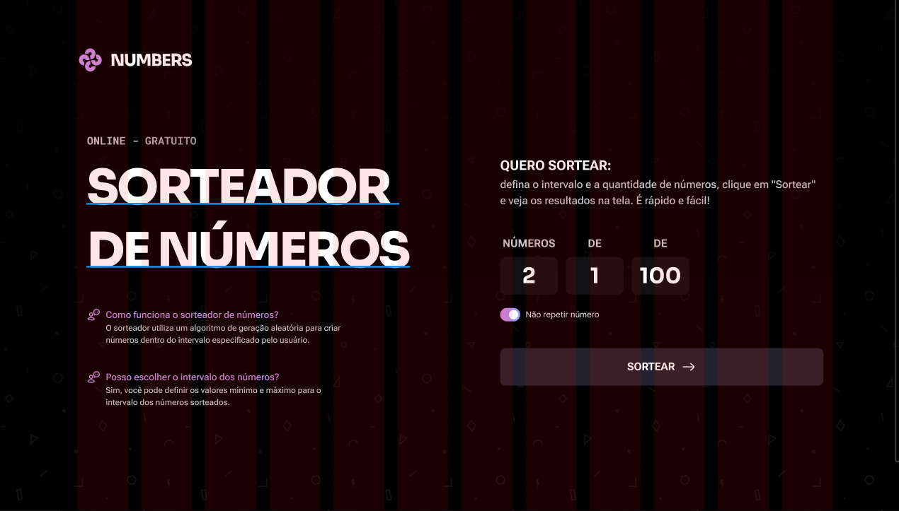

# Sorteador de números
- [ ] Ler as instruções
- [x] Quebrar em tasks e estimar como se fosse trabalho 

### Tasks
- Tasks
 - [ ] Task 1 - Layout Principal
 
    - Estimativa: 2 hrs
    - Tempo realizado: 50 min
    - Descrição - logo - primeiro conteudo lateral.

 - [ ] Task 2 - Aplicar responsividade no layout principal
    - Estimativa: 2,5 hrs
    - Tempo realizado: 0hrs

 - [ ] Task 3 - Fazer evento de sortear
    - Estimativa: 2 hrs
    - Tempo realizado: 0hrs

 - [ ] Task 4 - Fazer evento de sortear considerando flag "não repetir números".   
    - Estimativa: 2 hrs
    - Tempo realizado: 0hrs

- Tempo total do projeto: 0hrs
- Tempo estimado do projeto: 8,5hrs 
